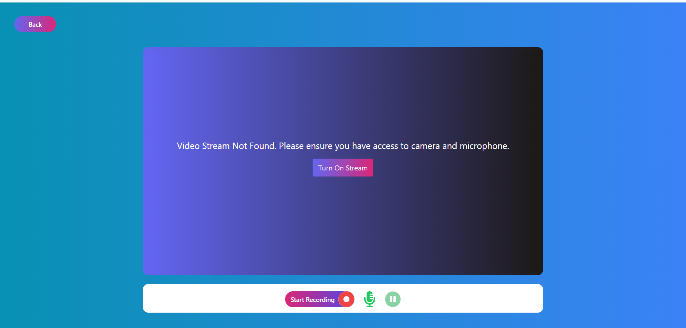

# RecordNinja  

RecordNinja is a powerful, sleek, and efficient tool designed to streamline your screen recording management and tracking needs. It combines an intuitive user interface with robust functionality, making it easy for individuals and businesses to record and download HD recordings effectively.  

---

## Table of Contents  

1. [Demo](#demo)  
2. [Installation](#installation)  
3. [Usage](#usage)  
4. [Screenshots](#screenshots)  
5. [License](#license)  

---

## Demo  

Explore the live application at:  
[RecordNinja Demo](https://reacordninja.vercel.app)  


## Installation  

Follow these steps to set up and run RecordNinja locally:  

### Prerequisites  
Ensure you have the following installed on your system:  
- **Node.js** (v16 or higher)  
- **npm** or **yarn**  

### Steps  

1. **Clone the Repository**  
   ```bash  
   git clone <https://github.com/iamaniketgupta/RecordNinja>  
   cd RecordNinja  
    ```
2. **Install Dependancies**
   ```bash  
   npm install  
   ```
3. **Run the Server**
   ```bash  
   npm run dev  
   ```

## Screenshots





---

## License  

© Aniket Gupta, 2024.  

This project is licensed under the **MIT License**.  

You are free to use, copy, modify, merge, publish, distribute, sublicense, and/or sell copies of the software, subject to the following conditions:  

1. **Permission**  
   - The above copyright notice and this permission notice shall be included in all copies or substantial portions of the software.  

2. **Disclaimer**  
   - This software is provided "as-is," without warranty of any kind, express or implied, including but not limited to the warranties of merchantability, fitness for a particular purpose, and non-infringement.  
   - In no event shall the authors or copyright holders be liable for any claim, damages, or other liability, whether in an action of contract, tort, or otherwise, arising from, out of, or in connection with the software or the use or other dealings in the software.  

For questions or contributions, feel free to contact:  
[iamaniketgupta1245@gmail.com@gmail.com](mailto:iamaniketgupta1245@gmail.com)  

---

